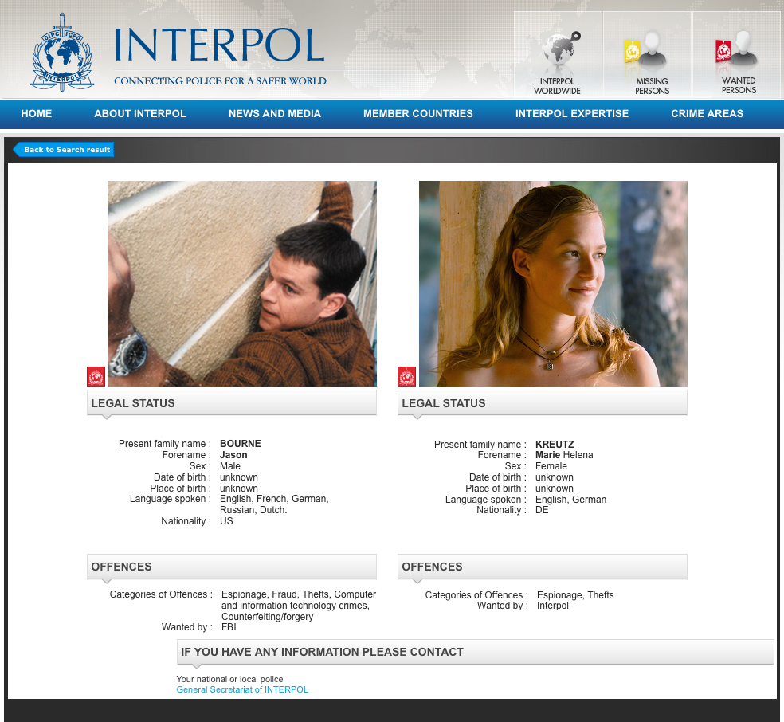
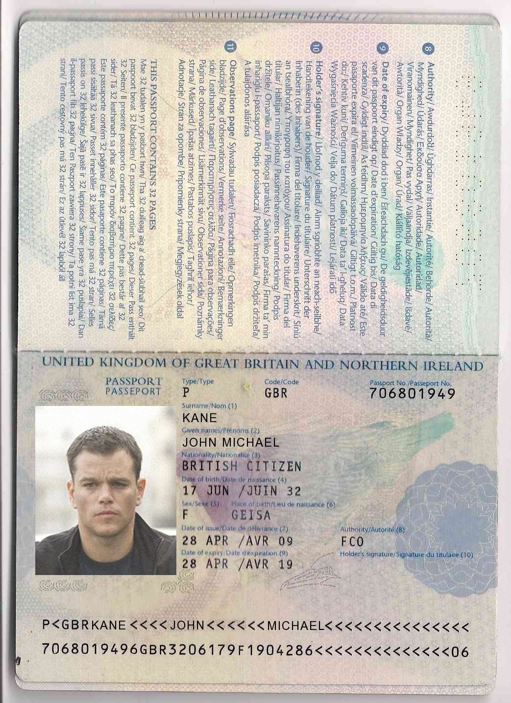

# Cyber Crime and Forensics lab-2:

**date:** 14 Jan 2017

**author:** Emil A. Sharifullin

Hard Disk forensics of Jason Borne's HDD

### HDD investigation

We found the HDD image. FIrst of all I calculated SHA-256 hash of image and it is `5ff109086b695c2ab803507808e2514ad5ddb934caff0b2ad08ee3696e28d4df`

```bash
root@kali:~# sha256sum '/media/root/b4442b20-0e65-4a0c-81f6-9023212e3c68/home/litleleprikon/temp/Evidence/primary-disk.dd' 
5ff109086b695c2ab803507808e2514ad5ddb934caff0b2ad08ee3696e28d4df /media/root/b4442b20-0e65-4a0c-81f6-9023212e3c68/home/litleleprikon/temp/Evidence/primary-disk.dd
```

After it I mounted this disk image to filesystem.

```bash
root@kali:~# mkdir /mnt/evidence
root@kali:~# mount -o ro /media/root/b4442b20-0e65-4a0c-81f6-9023212e3c68/home/litleleprikon/temp/Evidence/primary-disk.dd /mnt/evidence/
```

So now as we have access to disk image filesystem we can investigate it. First of all I understood that filesystem structure on this disk is very similar to Windows operating system filesystem structure.

I found two users: `jb` and `mk`. First I started to scan `jb` profile.

I found that Jason Bourne and Marie Kreutz are wanted by Interpol. And I also found that Jason Bourne created new passport with name John Michael Kane.



I also found keepass DB file `mypasswd.kdb` but at this moment I cannot decrypt it.

In Application Data folder I found direstories of couple popular applications: Skype, Mozilla, Thunderbird, etc. First I started to investigate thunderbird files.