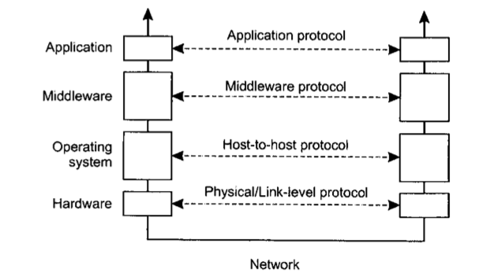

# Distributed Systems: Reading 3

**Author**: Emil A. Sharifullin 
**Date**:   3 November, 2016  

- **[DS]** Chapter 4. Distributed systems: principles and paradigms, Andrew S. Tanenbaum, Maarten Van Steen

### How are the OSI model layers mapped to the adapted (middleware-centric) reference model? Discuss in terms of functionality.

In middleware-centric model session and presentation layers is replaced by middleware layer which deals with all that this two protocols did.

 

### Give some examples of general-purpose protocols, which belong to the middleware layer. What types of distribution transparency do they provide?

DNS is a middleware protocol that belongs on application layer and provide location transparency.

### Give some examples of systems evolving from combining persistent/transient, synchronous/asynchronous and discrete/streaming communication. Which combination corresponds to RPC?

Redis in-memory database combines persistent/transient model becuse generally all data stored in RAM and removes after server shutted down but some important data can be writen on disk if needed. Many of realtime games combine synchronous/asynchronous model where important data sends in synchronous way and many of simple and not so important actions is sended via asynchronous way.  RPC is usually transiet, synchronous and discrete approach but in some cases there allowed exceprions.

### Can we simply use pointers as parameters in RPC calls without extra care? Why?

Pointers is a process/thread specific resources and on remote machine there are cannot be acccessible or can point to another resources so we cannot use pointers in RPC calls.

### In multicast RPC, should the client wait for all responses? Why?

It actually depends on application but in many applications it shouldn't wait all responces because some servers can be turned off and canot handle clients requests and client will wait response until the end of time.

### Consider implementing an application using RPC on top of streams (TCP) and datagrams (UDP) sockets, respectively. What would be your main challenge?

The main challenge is to chose which operations send during UDP and which via TCP. Actually UDP is usefull in realtime communications and in broadcast/multicast calls but it cannot provide reliability, error checking and sequence ordered delivery of packets. To solve previous three problems you can use TCP but it have couple of wicknesses as a long connection establishing and bigger amount of packets. Also with UDP you can easilly send packets and dont wait until another participant of communication will respond and it can reduce the time. 

### What are the differences between ZeroMQ and Berkeley (traditional) sockets? What is the side effect of asynchronous connection-oriented communication? What are the main communication patterns supported by ZeroMQ?

In ZeroMQ socket can be bound to different addresses and can provide many-to-one and one-to-many communications. ZeroMQ sockets also combine traditional connection approach with asynchronous model and this allows to "send" messages before communication will actually established. The main comunication patterns that ZeroMQ support is request-reply, publish-subscript and pipeline.

### What is the role of the message brokers? Why/when are they needed?

Message broker is an application that reformats incoming/outcoming messages to be correctly handled on the other side of communication. Message brokers provide compability between defferent components in heterogeneous distributed systems.