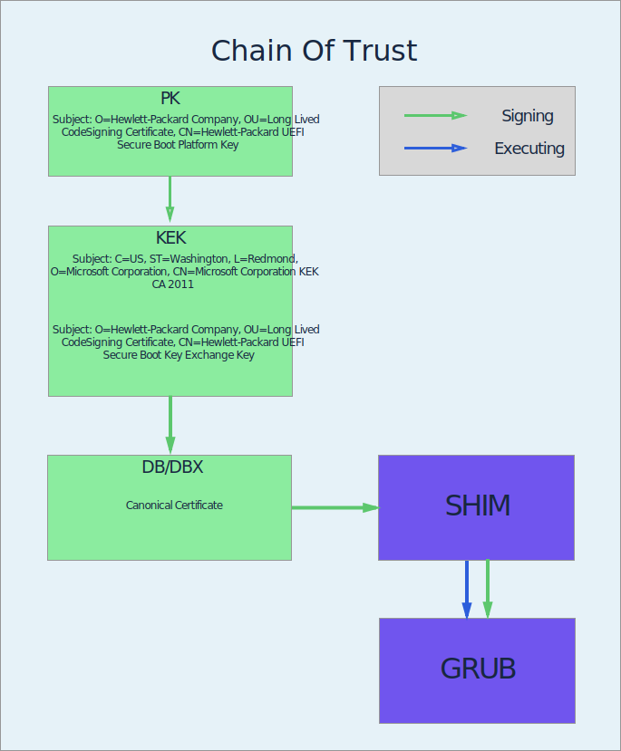

# Security of Systems and Networks: Lab 3

**Author**: Emil A. Sharifullin 
**Date**:   29 October, 2016  

UEFI Secure Boot

### Firmware Databases

####   Extract the Microsoft certificate that belongs to the key referred to in Step 1 from the UEFI firmware, and show it's text representation on your log.

Microsoft signs SHIM with DB key. To extract DB ke I used `mokutil --db` and I got result.

```
$ mokutil --db 
[key 1]
SHA1 Fingerprint: 46:de:f6:3b:5c:e6:1c:f8:ba:0d:e2:e6:63:9c:10:19:d0:ed:14:f3
Certificate:
    Data:
        Version: 3 (0x2)
        Serial Number:
            61:08:d3:c4:00:00:00:00:00:04
    Signature Algorithm: sha256WithRSAEncryption
        Issuer: C=US, ST=Washington, L=Redmond, O=Microsoft Corporation, CN=Microsoft Corporation Third Party Marketplace Root
        Validity
            Not Before: Jun 27 21:22:45 2011 GMT
            Not After : Jun 27 21:32:45 2026 GMT
        Subject: C=US, ST=Washington, L=Redmond, O=Microsoft Corporation, CN=Microsoft Corporation UEFI CA 2011
        Subject Public Key Info:
            Public Key Algorithm: rsaEncryption
                Public-Key: (2048 bit)
                Modulus:
                    00:a5:08:6c:4c:c7:45:09:6a:4b:0c:a4:c0:87:7f:
                    06:75:0c:43:01:54:64:e0:16:7f:07:ed:92:7d:0b:
                    b2:73:bf:0c:0a:c6:4a:45:61:a0:c5:16:2d:96:d3:
                    f5:2b:a0:fb:4d:49:9b:41:80:90:3c:b9:54:fd:e6:
                    bc:d1:9d:c4:a4:18:8a:7f:41:8a:5c:59:83:68:32:
                    bb:8c:47:c9:ee:71:bc:21:4f:9a:8a:7c:ff:44:3f:
                    8d:8f:32:b2:26:48:ae:75:b5:ee:c9:4c:1e:4a:19:
                    7e:e4:82:9a:1d:78:77:4d:0c:b0:bd:f6:0f:d3:16:
                    d3:bc:fa:2b:a5:51:38:5d:f5:fb:ba:db:78:02:db:
                    ff:ec:0a:1b:96:d5:83:b8:19:13:e9:b6:c0:7b:40:
                    7b:e1:1f:28:27:c9:fa:ef:56:5e:1c:e6:7e:94:7e:
                    c0:f0:44:b2:79:39:e5:da:b2:62:8b:4d:bf:38:70:
                    e2:68:24:14:c9:33:a4:08:37:d5:58:69:5e:d3:7c:
                    ed:c1:04:53:08:e7:4e:b0:2a:87:63:08:61:6f:63:
                    15:59:ea:b2:2b:79:d7:0c:61:67:8a:5b:fd:5e:ad:
                    87:7f:ba:86:67:4f:71:58:12:22:04:22:22:ce:8b:
                    ef:54:71:00:ce:50:35:58:76:95:08:ee:6a:b1:a2:
                    01:d5
                Exponent: 65537 (0x10001)
        X509v3 extensions:
            1.3.6.1.4.1.311.21.1: 
                .....
            1.3.6.1.4.1.311.21.2: 
                ....k..wSJ.%7.N.&{. p.
            X509v3 Subject Key Identifier: 
                13:AD:BF:43:09:BD:82:70:9C:8C:D5:4F:31:6E:D5:22:98:8A:1B:D4
            1.3.6.1.4.1.311.20.2: 
                .
.S.u.b.C.A
            X509v3 Key Usage: 
                Digital Signature, Certificate Sign, CRL Sign
            X509v3 Basic Constraints: critical
                CA:TRUE
            X509v3 Authority Key Identifier: 
                keyid:45:66:52:43:E1:7E:58:11:BF:D6:4E:9E:23:55:08:3B:3A:22:6A:A8

            X509v3 CRL Distribution Points: 

                Full Name:
                  URI:http://crl.microsoft.com/pki/crl/products/MicCorThiParMarRoo_2010-10-05.crl

            Authority Information Access: 
                CA Issuers - URI:http://www.microsoft.com/pki/certs/MicCorThiParMarRoo_2010-10-05.crt

    Signature Algorithm: sha256WithRSAEncryption
         35:08:42:ff:30:cc:ce:f7:76:0c:ad:10:68:58:35:29:46:32:
         76:27:7c:ef:12:41:27:42:1b:4a:aa:6d:81:38:48:59:13:55:
         f3:e9:58:34:a6:16:0b:82:aa:5d:ad:82:da:80:83:41:06:8f:
         b4:1d:f2:03:b9:f3:1a:5d:1b:f1:50:90:f9:b3:55:84:42:28:
         1c:20:bd:b2:ae:51:14:c5:c0:ac:97:95:21:1c:90:db:0f:fc:
         77:9e:95:73:91:88:ca:bd:bd:52:b9:05:50:0d:df:57:9e:a0:
         61:ed:0d:e5:6d:25:d9:40:0f:17:40:c8:ce:a3:4a:c2:4d:af:
         9a:12:1d:08:54:8f:bd:c7:bc:b9:2b:3d:49:2b:1f:32:fc:6a:
         21:69:4f:9b:c8:7e:42:34:fc:36:06:17:8b:8f:20:40:c0:b3:
         9a:25:75:27:cd:c9:03:a3:f6:5d:d1:e7:36:54:7a:b9:50:b5:
         d3:12:d1:07:bf:bb:74:df:dc:1e:8f:80:d5:ed:18:f4:2f:14:
         16:6b:2f:de:66:8c:b0:23:e5:c7:84:d8:ed:ea:c1:33:82:ad:
         56:4b:18:2d:f1:68:95:07:cd:cf:f0:72:f0:ae:bb:dd:86:85:
         98:2c:21:4c:33:2b:f0:0f:4a:f0:68:87:b5:92:55:32:75:a1:
         6a:82:6a:3c:a3:25:11:a4:ed:ad:d7:04:ae:cb:d8:40:59:a0:
         84:d1:95:4c:62:91:22:1a:74:1d:8c:3d:47:0e:44:a6:e4:b0:
         9b:34:35:b1:fa:b6:53:a8:2c:81:ec:a4:05:71:c8:9d:b8:ba:
         e8:1b:44:66:e4:47:54:0e:8e:56:7f:b3:9f:16:98:b2:86:d0:
         68:3e:90:23:b5:2f:5e:8f:50:85:8d:c6:8d:82:5f:41:a1:f4:
         2e:0d:e0:99:d2:6c:75:e4:b6:69:b5:21:86:fa:07:d1:f6:e2:
         4d:d1:da:ad:2c:77:53:1e:25:32:37:c7:6c:52:72:95:86:b0:
         f1:35:61:6a:19:f5:b2:3b:81:50:56:a6:32:2d:fe:a2:89:f9:
         42:86:27:18:55:a1:82:ca:5a:9b:f8:30:98:54:14:a6:47:96:
         25:2f:c8:26:e4:41:94:1a:5c:02:3f:e5:96:e3:85:5b:3c:3e:
         3f:bb:47:16:72:55:e2:25:22:b1:d9:7b:e7:03:06:2a:a3:f7:
         1e:90:46:c3:00:0d:d6:19:89:e3:0e:35:27:62:03:71:15:a6:
         ef:d0:27:a0:a0:59:37:60:f8:38:94:b8:e0:78:70:f8:ba:4c:
         86:87:94:f6:e0:ae:02:45:ee:65:c2:b6:a3:7e:69:16:75:07:
         92:9b:f5:a6:bc:59:83:58

[key 2]
SHA1 Fingerprint: 58:0a:6f:4c:c4:e4:b6:69:b9:eb:dc:1b:2b:3e:08:7b:80:d0:67:8d
Certificate:
    Data:
        Version: 3 (0x2)
        Serial Number:
            61:07:76:56:00:00:00:00:00:08
    Signature Algorithm: sha256WithRSAEncryption
        Issuer: C=US, ST=Washington, L=Redmond, O=Microsoft Corporation, CN=Microsoft Root Certificate Authority 2010
        Validity
            Not Before: Oct 19 18:41:42 2011 GMT
            Not After : Oct 19 18:51:42 2026 GMT
        Subject: C=US, ST=Washington, L=Redmond, O=Microsoft Corporation, CN=Microsoft Windows Production PCA 2011
        Subject Public Key Info:
            Public Key Algorithm: rsaEncryption
                Public-Key: (2048 bit)
                Modulus:
                    00:dd:0c:bb:a2:e4:2e:09:e3:e7:c5:f7:96:69:bc:
                    00:21:bd:69:33:33:ef:ad:04:cb:54:80:ee:06:83:
                    bb:c5:20:84:d9:f7:d2:8b:f3:38:b0:ab:a4:ad:2d:
                    7c:62:79:05:ff:e3:4a:3f:04:35:20:70:e3:c4:e7:
                    6b:e0:9c:c0:36:75:e9:8a:31:dd:8d:70:e5:dc:37:
                    b5:74:46:96:28:5b:87:60:23:2c:bf:dc:47:a5:67:
                    f7:51:27:9e:72:eb:07:a6:c9:b9:1e:3b:53:35:7c:
                    e5:d3:ec:27:b9:87:1c:fe:b9:c9:23:09:6f:a8:46:
                    91:c1:6e:96:3c:41:d3:cb:a3:3f:5d:02:6a:4d:ec:
                    69:1f:25:28:5c:36:ff:fd:43:15:0a:94:e0:19:b4:
                    cf:df:c2:12:e2:c2:5b:27:ee:27:78:30:8b:5b:2a:
                    09:6b:22:89:53:60:16:2c:c0:68:1d:53:ba:ec:49:
                    f3:9d:61:8c:85:68:09:73:44:5d:7d:a2:54:2b:dd:
                    79:f7:15:cf:35:5d:6c:1c:2b:5c:ce:bc:9c:23:8b:
                    6f:6e:b5:26:d9:36:13:c3:4f:d6:27:ae:b9:32:3b:
                    41:92:2c:e1:c7:cd:77:e8:aa:54:4e:f7:5c:0b:04:
                    87:65:b4:43:18:a8:b2:e0:6d:19:77:ec:5a:24:fa:
                    48:03
                Exponent: 65537 (0x10001)
        X509v3 extensions:
            1.3.6.1.4.1.311.21.1: 
                ...
            X509v3 Subject Key Identifier: 
                A9:29:02:39:8E:16:C4:97:78:CD:90:F9:9E:4F:9A:E1:7C:55:AF:53
            1.3.6.1.4.1.311.20.2: 
                .
.S.u.b.C.A
            X509v3 Key Usage: 
                Digital Signature, Certificate Sign, CRL Sign
            X509v3 Basic Constraints: critical
                CA:TRUE
            X509v3 Authority Key Identifier: 
                keyid:D5:F6:56:CB:8F:E8:A2:5C:62:68:D1:3D:94:90:5B:D7:CE:9A:18:C4

            X509v3 CRL Distribution Points: 

                Full Name:
                  URI:http://crl.microsoft.com/pki/crl/products/MicRooCerAut_2010-06-23.crl

            Authority Information Access: 
                CA Issuers - URI:http://www.microsoft.com/pki/certs/MicRooCerAut_2010-06-23.crt

    Signature Algorithm: sha256WithRSAEncryption
         14:fc:7c:71:51:a5:79:c2:6e:b2:ef:39:3e:bc:3c:52:0f:6e:
         2b:3f:10:13:73:fe:a8:68:d0:48:a6:34:4d:8a:96:05:26:ee:
         31:46:90:61:79:d6:ff:38:2e:45:6b:f4:c0:e5:28:b8:da:1d:
         8f:8a:db:09:d7:1a:c7:4c:0a:36:66:6a:8c:ec:1b:d7:04:90:
         a8:18:17:a4:9b:b9:e2:40:32:36:76:c4:c1:5a:c6:bf:e4:04:
         c0:ea:16:d3:ac:c3:68:ef:62:ac:dd:54:6c:50:30:58:a6:eb:
         7c:fe:94:a7:4e:8e:f4:ec:7c:86:73:57:c2:52:21:73:34:5a:
         f3:a3:8a:56:c8:04:da:07:09:ed:f8:8b:e3:ce:f4:7e:8e:ae:
         f0:f6:0b:8a:08:fb:3f:c9:1d:72:7f:53:b8:eb:be:63:e0:e3:
         3d:31:65:b0:81:e5:f2:ac:cd:16:a4:9f:3d:a8:b1:9b:c2:42:
         d0:90:84:5f:54:1d:ff:89:ea:ba:1d:47:90:6f:b0:73:4e:41:
         9f:40:9f:5f:e5:a1:2a:b2:11:91:73:8a:21:28:f0:ce:de:73:
         39:5f:3e:ab:5c:60:ec:df:03:10:a8:d3:09:e9:f4:f6:96:85:
         b6:7f:51:88:66:47:19:8d:a2:b0:12:3d:81:2a:68:05:77:bb:
         91:4c:62:7b:b6:c1:07:c7:ba:7a:87:34:03:0e:4b:62:7a:99:
         e9:ca:fc:ce:4a:37:c9:2d:a4:57:7c:1c:fe:3d:dc:b8:0f:5a:
         fa:d6:c4:b3:02:85:02:3a:ea:b3:d9:6e:e4:69:21:37:de:81:
         d1:f6:75:19:05:67:d3:93:57:5e:29:1b:39:c8:ee:2d:e1:cd:
         e4:45:73:5b:d0:d2:ce:7a:ab:16:19:82:46:58:d0:5e:9d:81:
         b3:67:af:6c:35:f2:bc:e5:3f:24:e2:35:a2:0a:75:06:f6:18:
         56:99:d4:78:2c:d1:05:1b:eb:d0:88:01:9d:aa:10:f1:05:df:
         ba:7e:2c:63:b7:06:9b:23:21:c4:f9:78:6c:e2:58:17:06:36:
         2b:91:12:03:cc:a4:d9:f2:2d:ba:f9:94:9d:40:ed:18:45:f1:
         ce:8a:5c:6b:3e:ab:03:d3:70:18:2a:0a:6a:e0:5f:47:d1:d5:
         63:0a:32:f2:af:d7:36:1f:2a:70:5a:e5:42:59:08:71:4b:57:
         ba:7e:83:81:f0:21:3c:f4:1c:c1:c5:b9:90:93:0e:88:45:93:
         86:e9:b1:20:99:be:98:cb:c5:95:a4:5d:62:d6:a0:63:08:20:
         bd:75:10:77:7d:3d:f3:45:b9:9f:97:9f:cb:57:80:6f:33:a9:
         04:cf:77:a4:62:1c:59:7e

[key 3]
SHA1 Fingerprint: 69:52:5b:09:5f:85:f4:c1:fb:77:e6:9a:f6:63:52:d1:dc:19:11:01
Certificate:
    Data:
        Version: 3 (0x2)
        Serial Number:
            53:f9:be:1a:93:a3:cb:05:6b:03:8d:5b:27:af:89:b2
    Signature Algorithm: sha256WithRSAEncryption
        Issuer: C=US, O=Hewlett-Packard Company, CN=Hewlett-Packard Printing Device Infrastructure CA
        Validity
            Not Before: Aug 23 00:00:00 2012 GMT
            Not After : Aug 23 23:59:59 2032 GMT
        Subject: O=Hewlett-Packard Company, OU=Long Lived CodeSigning Certificate, CN=Hewlett-Packard UEFI Secure Boot DB Key
        Subject Public Key Info:
            Public Key Algorithm: rsaEncryption
                Public-Key: (2048 bit)
                Modulus:
                    00:ce:56:d3:c0:85:e1:c9:69:09:62:73:73:ef:e3:
                    82:98:fa:a4:c2:b5:85:f2:6b:f0:8a:02:b8:15:77:
                    11:27:e0:33:10:61:ff:8e:2b:c3:c2:6d:b5:c4:01:
                    d1:3e:7a:4e:93:da:ca:0b:85:8e:0a:84:c8:1f:0d:
                    68:e7:08:e5:89:6a:3b:ba:7d:fb:96:d2:4f:c1:60:
                    49:85:b7:a4:fd:f2:a3:44:21:15:c4:ef:bc:f8:f1:
                    a9:18:5f:4c:78:3c:5b:97:5b:69:75:f7:78:94:ff:
                    3c:00:af:ae:96:8b:51:03:bd:9a:e2:e3:94:53:35:
                    ec:72:f9:77:07:35:c5:18:c5:1a:7e:16:1b:1b:cb:
                    1d:f3:8d:e4:4f:68:d3:ec:8c:46:b0:2d:10:b2:37:
                    66:23:51:97:fb:26:89:9c:12:2d:77:a5:0e:82:b1:
                    d2:83:5a:d1:36:f1:fd:d4:7c:e0:2c:2b:f8:56:4b:
                    aa:db:0b:cf:a4:2d:68:81:b8:49:d3:37:6d:7d:de:
                    d3:85:3f:1f:e6:d9:4c:01:44:da:ea:e0:45:ea:c9:
                    2f:af:c1:0d:c4:35:43:17:ca:16:93:82:f2:1d:d1:
                    ce:de:07:e4:d7:93:31:ea:66:3b:13:d4:86:55:a4:
                    48:fb:6a:e1:e0:f7:84:50:86:bd:c8:5d:3e:90:2a:
                    a4:6d
                Exponent: 65537 (0x10001)
        X509v3 extensions:
            X509v3 Basic Constraints: critical
                CA:FALSE
            X509v3 CRL Distribution Points: 

                Full Name:
                  URI:http://onsitecrl.verisign.com/HewlettPackardCompanyDeSPrintingDeviceCSIDTemp/LatestCRL.crl

            X509v3 Key Usage: critical
                Digital Signature
            X509v3 Certificate Policies: 
                Policy: 1.3.6.1.4.1.11.4.4.1.1
                  User Notice:
                    Explicit Text: Hewlett Packard Company, 2, Authority to bind Hewlett-Packard Company does not correspond with use or possession of this certificate. Issued to facilitate communication with HP.

            Authority Information Access: 
                OCSP - URI:http://onsite-ocsp.verisign.com

            X509v3 Subject Key Identifier: 
                E7:20:3A:C2:8B:84:8D:3C:03:43:2F:6A:48:5D:D1:F4:C7:B8:E5:29
            X509v3 Authority Key Identifier: 
                keyid:B8:A1:0C:BD:06:5F:46:11:E9:80:DB:F7:99:BD:1D:F4:FD:EA:0D:C6

            X509v3 Extended Key Usage: critical
                Code Signing
    Signature Algorithm: sha256WithRSAEncryption
         67:1a:de:a9:c8:ac:9b:db:75:c2:1e:8e:e5:5f:38:aa:72:c5:
         e0:10:2f:a3:ce:a7:9b:cb:39:7c:98:e6:4f:9a:36:d5:21:ea:
         a4:a0:5d:53:40:74:e6:1e:c2:2b:fc:f2:d8:68:9e:69:f6:c4:
         24:f1:91:82:b7:3f:a1:c6:60:3d:08:10:3c:36:3d:7b:71:23:
         cc:06:6c:dc:ae:a3:0a:4b:d0:4b:a3:75:5e:55:1c:7f:52:19:
         e7:da:b7:69:ea:d0:28:d6:b6:39:ac:d2:b0:3f:90:34:0e:43:
         c4:ca:a8:29:38:b2:26:f5:4c:0c:cf:21:b7:4b:79:43:43:0d:
         8a:17:b9:41:34:5f:27:9e:83:77:65:c8:b8:a1:a6:4d:ed:b0:
         5e:4f:ee:ee:b6:05:0a:2c:10:7e:b7:fc:43:ab:53:cd:57:98:
         67:df:03:11:3a:49:de:73:b8:a6:9e:13:2c:b6:55:41:85:24:
         d7:cf:04:e1:db:16:33:83:24:92:7a:fa:3f:5e:87:0c:f5:07:
         db:12:f1:ed:88:67:c3:cc:da:4d:a6:9a:3f:a7:70:30:57:86:
         b7:1c:fa:de:e9:36:af:29:77:ce:90:95:d8:c2:db:97:85:88:
         0a:1d:a2:8e:45:76:2d:a8:22:a4:92:e9:b3:bc:6c:86:f7:a7:
         73:f0:15:7c

```

Here there are two keys: from HP and from Microsoft.

#### Is this certificate the root certificate in the chain of trust? What is the role of the Platform Key (PK)?

There is not a Platform Key. Platform Key is root certificate that manufacturer set to hardware and with this certificates signs KEK's.

### SHIM
#### Verify that the system indeed boots the ‘shim’ boot loader in the first stage. What is the full path name of this boot loader?

```bash
$ efibootmgr -v
BootCurrent: 000A
Timeout: 0 seconds
BootOrder: 000A,0002,0007,0001,0003,0008,0005,0006
Boot0001* DTO UEFI USB Floppy/CD	VenMedia(b6fef66f-1495-4584-a836-3492d1984a8d,0500000001)..BO
Boot0002* DTO UEFI USB Hard Drive	VenMedia(b6fef66f-1495-4584-a836-3492d1984a8d,0200000001)..BO
Boot0003* DTO UEFI ATAPI CD-ROM Drive	VenMedia(b6fef66f-1495-4584-a836-3492d1984a8d,0300000001)..BO
Boot0005  DTO Legacy USB Floppy/CD	VenMedia(b6fef66f-1495-4584-a836-3492d1984a8d,0500000000)..BO
Boot0006  Hard Drive	BBS(HD,,0x0)..GO..NO?.........F.a.k.e. .U.s.b. .O.p.t.i.o.n.................BO
Boot0007* IP4 Intel(R) Ethernet Connection I217-LM	PciRoot(0x0)/Pci(0x19,0x0)/MAC(ecb1d73d306a,0)/IPv4(0.0.0.0:0<->0.0.0.0:0,0,0)..BO
Boot0008* IP6 Intel(R) Ethernet Connection I217-LM	PciRoot(0x0)/Pci(0x19,0x0)/MAC(ecb1d73d306a,0)/IPv6([::]:<->[::]:,0,0)..BO
Boot000A* ubuntu	HD(1,GPT,90b0afe7-7108-4ebe-82f8-0cd535c8616b,0x800,0x100000)/File(\EFI\ubuntu\shimx64.efi)
```

At the last line we can see that shim was loaded from \EFI\ubuntu\shimx64.efi

#### Verify that the ‘shim’ boot loader is indeed signed with the ‘Microsoft Corporation UEFI CA’ key. Hint: sbsigntool, PEM format

To extract verifi SHIM I firstly checked image.

```bash
$ sudo binwalk /boot/efi/EFI/ubuntu/shimx64.efi

DECIMAL       HEXADECIMAL     DESCRIPTION
--------------------------------------------------------------------------------
0             0x0             Microsoft executable, portable (PE)
75931         0x1289B         mcrypt 2.2 encrypted data, algorithm: blowfish-448, mode: CBC, keymode: 8bit
751040        0xB75C0         SHA256 hash constants, little endian
781251        0xBEBC3         Ubiquiti firmware header, third party, ~CRC32: 0x10000, version: "SSL_init"
807162        0xC50FA         Unix path: /usr/local/ssl/private
808128        0xC54C0         Unix path: /usr/local/ssl/lib/engines
818688        0xC7E00         Certificate in DER format (x509 v3), header length: 4, sequence length: 924
923264        0xE1680         Base64 standard index table
931344        0xE3610         Certificate in DER format (x509 v3), header length: 4, sequence length: 1076
1159455       0x11B11F        mcrypt 2.2 encrypted data, algorithm: blowfish-448, mode: CBC, keymode: 8bit
1280941       0x138BAD        Certificate in DER format (x509 v3), header length: 4, sequence length: 1316
1282261       0x1390D5        Certificate in DER format (x509 v3), header length: 4, sequence length: 1552
1284166       0x139846        Unix path: /www.microsoft.com/whdc/hcl/default.mspx0
1284873       0x139B09        Certificate in DER format (x509 v3), header length: 4, sequence length: 1649
1286526       0x13A17E        Certificate in DER format (x509 v3), header length: 4, sequence length: 1242
```

Now using dd I can extract certificates.

```bash
$ dd if=shimx64.efi of=cert1.crt skip=818688 count=928 bs=1
928+0 records in
928+0 records out
928 bytes copied, 0.00714302 s, 130 kB/s
$ dd if=shimx64.efi of=cert2.crt skip=931344 count=1080 bs=1
1080+0 records in
1080+0 records out
1080 bytes (1.1 kB, 1.1 KiB) copied, 0.00839018 s, 129 kB/s
$ dd if=shimx64.efi of=cert3.crt skip=1280941 count=1320 bs=1
1320+0 records in
1320+0 records out
1320 bytes (1.3 kB, 1.3 KiB) copied, 0.010206 s, 129 kB/s
$ dd if=shimx64.efi of=cert4.crt skip=1282261 count=1556 bs=1
1556+0 records in
1556+0 records out
1556 bytes (1.6 kB, 1.5 KiB) copied, 0.0112912 s, 138 kB/s
$ dd if=shimx64.efi of=cert5.crt skip=1284873 count=1653 bs=1
1653+0 records in
1653+0 records out
1653 bytes (1.7 kB, 1.6 KiB) copied, 0.0121751 s, 136 kB/s
$ dd if=shimx64.efi of=cert6.crt skip=1286526 count=1246 bs=1
1246+0 records in
1246+0 records out
1246 bytes (1.2 kB, 1.2 KiB) copied, 0.00964122 s, 129 kB/s
```

To use this certs in `sbverify` tool there is needed to convert them to pem format.

```bash
$ openssl x509 -inform der -in cert1.crt -out cert1.pem
$ openssl x509 -inform der -in cert1.crt -out cert1.pem      
$ openssl x509 -inform der -in cert2.crt -out cert2.pem
$ openssl x509 -inform der -in cert3.crt -out cert3.pem
$ openssl x509 -inform der -in cert4.crt -out cert4.pem
$ openssl x509 -inform der -in cert5.crt -out cert5.pem
$ openssl x509 -inform der -in cert6.crt -out cert6.pem
```

I tried to verify SHIM with all of this certificates and one got good signature.

```bash
$ sbverify --cert cert4.pem shimx64.efi
warning: data remaining[1170360 vs 1289424]: gaps between PE/COFF sections?
Signature verification OK
```

#### Read the first 9 pages of the specification (up to “Authenticode-Specific Structures”). Focus on the structure of the binaries. What is the name of the part of the binary where the actual signature data is stored?
Signature data is stored in **SignedData** strusture.


#### In what standard cryptographic format is the signature data stored?
SignedData is stored in PKCS format and contains PE file's hash, signature and X.509 v3 certificates.

To locate signature data I followed instructions in assignment documen:
```bash
$ pyew shimx64.efi 

(process:22931): Gtk-WARNING **: Locale not supported by C library.
	Using the fallback 'C' locale.
/usr/lib/python2.7/dist-packages/gtk-2.0/gtk/__init__.py:57: GtkWarning: could not open display
  warnings.warn(str(e), _gtk.Warning)
PE Information

64 Bits binary
Sections:
   /4 0x5000 0x161e0 90624
   .text 0x1c000 0x9f5ec 652800
   .reloc 0xbc000 0xa 512
   .data 0xbd000 0x2d718 186368
   /14 0xeb000 0x449 1536
   .dynamic 0xec000 0xf0 512
   .rela 0xed000 0x29598 169472
   .dynsym 0x117000 0xe538 58880

Entry Point at 0x16600
Virtual Address is 0x1c000
***Error loading imports PE instance has no attribute 'DIRECTORY_ENTRY_IMPORT'
Code Analysis ...
Found 2602 possible function(s) using method #1                    
Found 2602 possible function(s) using method #2                    
Analyzing address 0x000b572b - 0 in queue / 2290 total


0000   4D 5A 90 00 03 00 00 00 04 00 00 00 FF FF 00 00    MZ..............
0010   B8 00 00 00 00 00 00 00 40 00 00 00 00 00 00 00    ........@.......
0020   00 00 00 00 00 00 00 00 00 00 00 00 00 00 00 00    ................
0030   00 00 00 00 00 00 00 00 00 00 00 00 80 00 00 00    ................
0040   0E 1F BA 0E 00 B4 09 CD 21 B8 01 4C CD 21 54 68    ........!..L.!Th
0050   69 73 20 70 72 6F 67 72 61 6D 20 63 61 6E 6E 6F    is program canno
0060   74 20 62 65 20 72 75 6E 20 69 6E 20 44 4F 53 20    t be run in DOS 
0070   6D 6F 64 65 2E 0D 0D 0A 24 00 00 00 00 00 00 00    mode....$.......
0080   50 45 00 00 64 86 08 00 05 09 0C 00 00 BA 11 00    PE..d...........
0090   7A 0D 00 00 F0 00 06 02 0B 02 02 19 00 F6 09 00    z...............
00A0   00 C0 07 00 00 E6 00 00 00 C0 01 00 00 C0 01 00    ................
00B0   00 00 00 00 00 00 00 00 00 10 00 00 00 02 00 00    ................
00C0   00 00 00 00 00 00 00 00 00 00 00 00 00 00 00 00    ................
00D0   00 60 12 00 00 04 00 00 1E 13 14 00 0A 00 00 00    .`..............
00E0   00 00 00 00 00 00 00 00 00 00 00 00 00 00 00 00    ................
00F0   00 00 00 00 00 00 00 00 00 00 00 00 00 00 00 00    ................
0100   00 00 00 00 10 00 00 00 00 00 00 00 00 00 00 00    ................
0110   00 00 00 00 00 00 00 00 00 00 00 00 00 00 00 00    ................
0120   00 00 00 00 00 00 00 00 18 8B 13 00 B8 21 00 00    .............!..
0130   00 C0 0B 00 0A 00 00 00 00 00 00 00 00 00 00 00    ................
0140   00 00 00 00 00 00 00 00 00 00 00 00 00 00 00 00    ................
0150   00 00 00 00 00 00 00 00 00 00 00 00 00 00 00 00    ................
0160   00 00 00 00 00 00 00 00 00 00 00 00 00 00 00 00    ................
0170   00 00 00 00 00 00 00 00 00 00 00 00 00 00 00 00    ................
0180   00 00 00 00 00 00 00 00 2F 34 00 00 00 00 00 00    ......../4......
0190   E0 61 01 00 00 50 00 00 00 62 01 00 00 04 00 00    .a...P...b......
01A0   00 00 00 00 00 00 00 00 00 00 00 00 40 00 40 40    ............@.@@
01B0   2E 74 65 78 74 00 00 00 EC F5 09 00 00 C0 01 00    .text...........
01C0   00 F6 09 00 00 66 01 00 00 00 00 00 00 00 00 00    .....f..........
01D0   00 00 00 00 20 00 50 60 2E 72 65 6C 6F 63 00 00    .... .P`.reloc..
01E0   0A 00 00 00 00 C0 0B 00 00 02 00 00 00 5C 0B 00    ................
01F0   00 00 00 00 00 00 00 00 00 00 00 00 40 00 10 42    ............@..B

[0x00000000]> pyew.pe.OPTIONAL_HEADER.DATA_DIRECTORY
[<Structure: [IMAGE_DIRECTORY_ENTRY_EXPORT] 0x108 0x0 VirtualAddress: 0x0 0x10C 0x4 Size: 0x0>,
 <Structure: [IMAGE_DIRECTORY_ENTRY_IMPORT] 0x110 0x0 VirtualAddress: 0x0 0x114 0x4 Size: 0x0>,
 <Structure: [IMAGE_DIRECTORY_ENTRY_RESOURCE] 0x118 0x0 VirtualAddress: 0x0 0x11C 0x4 Size: 0x0>,
 <Structure: [IMAGE_DIRECTORY_ENTRY_EXCEPTION] 0x120 0x0 VirtualAddress: 0x0 0x124 0x4 Size: 0x0>,
 <Structure: [IMAGE_DIRECTORY_ENTRY_SECURITY] 0x128 0x0 VirtualAddress: 0x138B18 0x12C 0x4 Size: 0x21B8>,
 <Structure: [IMAGE_DIRECTORY_ENTRY_BASERELOC] 0x130 0x0 VirtualAddress: 0xBC000 0x134 0x4 Size: 0xA>,
 <Structure: [IMAGE_DIRECTORY_ENTRY_DEBUG] 0x138 0x0 VirtualAddress: 0x0 0x13C 0x4 Size: 0x0>,
 <Structure: [IMAGE_DIRECTORY_ENTRY_COPYRIGHT] 0x140 0x0 VirtualAddress: 0x0 0x144 0x4 Size: 0x0>,
 <Structure: [IMAGE_DIRECTORY_ENTRY_GLOBALPTR] 0x148 0x0 VirtualAddress: 0x0 0x14C 0x4 Size: 0x0>,
 <Structure: [IMAGE_DIRECTORY_ENTRY_TLS] 0x150 0x0 VirtualAddress: 0x0 0x154 0x4 Size: 0x0>,
 <Structure: [IMAGE_DIRECTORY_ENTRY_LOAD_CONFIG] 0x158 0x0 VirtualAddress: 0x0 0x15C 0x4 Size: 0x0>,
 <Structure: [IMAGE_DIRECTORY_ENTRY_BOUND_IMPORT] 0x160 0x0 VirtualAddress: 0x0 0x164 0x4 Size: 0x0>,
 <Structure: [IMAGE_DIRECTORY_ENTRY_IAT] 0x168 0x0 VirtualAddress: 0x0 0x16C 0x4 Size: 0x0>,
 <Structure: [IMAGE_DIRECTORY_ENTRY_DELAY_IMPORT] 0x170 0x0 VirtualAddress: 0x0 0x174 0x4 Size: 0x0>,
 <Structure: [IMAGE_DIRECTORY_ENTRY_COM_DESCRIPTOR] 0x178 0x0 VirtualAddress: 0x0 0x17C 0x4 Size: 0x0>,
 <Structure: [IMAGE_DIRECTORY_ENTRY_RESERVED] 0x180 0x0 VirtualAddress: 0x0 0x184 0x4 Size: 0x0>]
```

Now we know location and size of signature data from this line `<Structure: [IMAGE_DIRECTORY_ENTRY_SECURITY] 0x128 0x0 VirtualAddress: 0x138B18 0x12C 0x4 Size: 0x21B8>,` and location is 1280792 byte and size is 8632 bytes.

#### Extract the signature data from the ‘shim’ binary using dd. Add 8 bytes to the location as given in the data directory to skip over the Microsoft WIN CERTIFICAT structure header (see page 14 of the specification if you are interested). Show the command you used.

To extract signature data I used following command `dd if=shimx64.efi of=signature skip=$((0x138B18+0x8)) count=$((0x21B8)) iflag=skip_bytes,count_bytes`. In this command I added 8 bytes to skip  **Microsoft WIN CERTIFICAT structure header**.

After I extracted with binwalk all certificates. And verify with them
```bash
$ binwalk -e sigData.der
$ openssl x509 -inform der -in 1607.crt -out 1607.pem
$ openssl x509 -inform der -in 36.crt -out 36.pem
$ openssl x509 -inform der -in 55E.crt -out 55E.pem
$ openssl x509 -inform der -in F92.crt -out F92.pem
$ sbverify --cert ./_sigData.der.extracted/55E.pem shimx64.efi 
warning: data remaining[1170360 vs 1289424]: gaps between PE/COFF sections?
Signature verification OK
```

### GRUB

#### Using your new knowledge about Authenticode binaries, extract the signing certificates from the GRUB boot loader, and show the subject and issuer.

```bash
$ binwalk grubx64.efi | grep -i certificate
1101489       0x10CEB1        Certificate in DER format (x509 v3), header length: 4, sequence length: 1056
$ binwalk - grubx64.efi
$ openssl x509 -inform der -in _grubx64.efi.extracted/10CEB1.crt -out grub.pem
$ openssl x509 -text -noout -in grub.pem | grep -iE 'issuer|subject'     
        Issuer: C=GB, ST=Isle of Man, L=Douglas, O=Canonical Ltd., CN=Canonical Ltd. Master Certificate Authority
        Subject: C=GB, ST=Isle of Man, O=Canonical Ltd., OU=Secure Boot, CN=Canonical Ltd. Secure Boot Signing
        Subject Public Key Info:
            X509v3 Subject Key Identifier: 
```

#### Why is storing the certificate X in the ‘shim’ binary secure?

Because SHIM is signed with Microsoft KEK and every changing of SHIM will brake chain of trust.

#### What do you think is the subject CommonName (CN) of this X certificate?
Common Name is contains Subject Name for certain certificate.

#### Obtain the X certificate used by ‘shim’ to verify the GRUB binary.
In 4'th step I exported certificates from shim and now I can use one of them to check GRUB signature.

```bash
$ openssl x509 -text -noout -in cert2.pem | grep -iE 'issuer|subject'
        Issuer: C=GB, ST=Isle of Man, L=Douglas, O=Canonical Ltd., CN=Canonical Ltd. Master Certificate Authority
        Subject: C=GB, ST=Isle of Man, L=Douglas, O=Canonical Ltd., CN=Canonical Ltd. Master Certificate Authority
        Subject Public Key Info:
            X509v3 Subject Key Identifier: 
```
#### Verify that this X certificate’s corresponding private key was indeed used to sign the GRUB binary.

```bash
$ shim sbverify --cert cert2.pem grubx64.efi
Signature verification OK
```

### The Kernel

#### Verify the kernel you booted against the X certificate.
The certificate for kernel is stored in the SHIM and to verify I against searched right one and verified with it.
```bash
$ $ openssl x509 -text -noout -in cert2.pem | grep -iE 'issuer|subject'
        Issuer: C=GB, ST=Isle of Man, L=Douglas, O=Canonical Ltd., CN=Canonical Ltd. Master Certificate Authority
        Subject: C=GB, ST=Isle of Man, L=Douglas, O=Canonical Ltd., CN=Canonical Ltd. Master Certificate Authority
        Subject Public Key Info:
            X509v3 Subject Key Identifier: 
$ sbverify --cert cert2.pem vmlinuz-4.4.0-45-generic.efi.signed
Signature verification OK
```

#### Where does GRUB get its trusted certificate from? Hint: It is not stored in the binary, and it is not stored on the file system.
It's stored in SHIM.

#### Draw a diagram that shows the chain of trust from the UEFI PK key to the signed kernel. Show all certificates, binaries and signing relations involved.

