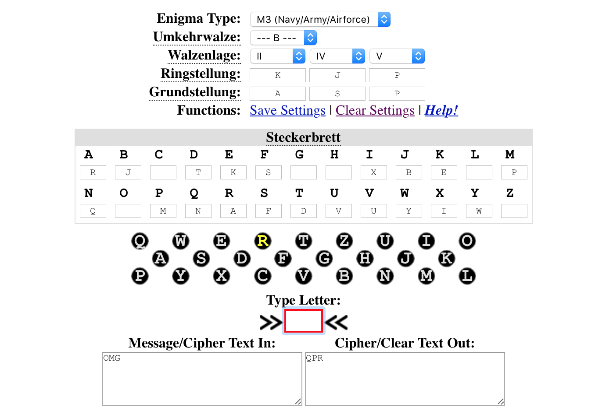
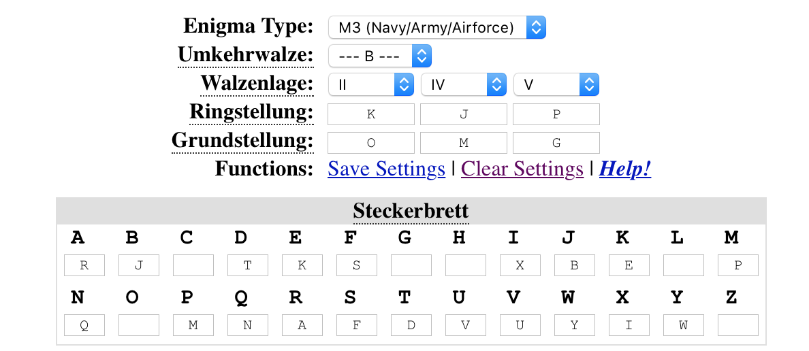

# Security of Systems and Networks: Lab 3

**Author**: Emil A. Sharifullin 
**Date**:   28 October, 2016  

Enigma

### Enigma

##### Encryption

My birthaday is 20 December and I send it to Emil Melnikov. I chase  ASM for Gruntstellung and OMG as first random three letters.
```
| 20   | II   IV   V | 11 10 16 | AR BJ DT EK FS IX MP NQ UV WY | WKP TML UEH ZSB |
```
After I set up the enigma machine as following: 

 

And then I encrypt my random three letters with this setting to paste it to message I get QPR. Then I set encrypted three random letters as Gruntstellung and encrypt message.

 


After all I create ciphertext: Kengruppen, Gruntstellung, Encrypted Three random Letters and ciphertext.
My plain text: I want to get a lot of bubble gum on my birthday

```
ZSBAS MQPRL GILAZ STCMT ZVCFR WFZCV DETZW PQVDR PBVPC B
```


##### Decription
Emil sent me following ciphertext and his Birthday is 3 of May.
```
WRNCX NXFVT SBEQA AAVHW ACCMR QMVJG XPFQX APFZA VTHZQ
```
With Kengruppen WRN I compare the date. After date I set up enigma with following settings.

```
| 03   | II   I    V | 12 14 02 | AM BL EK FP HS IO JV NW QR TX | OOG WRN RWK NGP |
```
For Grundstellung I use CXN from message and decrypt with it XFV and got RTP. And with this settings I decrypt message

```
ON EMON THHO LIDA YINT HEWO ODSO FGRE ENLA ND
```

### Viola

In Viola there are 

$$
5*30^{2*10} * \frac{50!}{(50-10)!} * \frac{30!}{(30-15)!}
$$

possible variants. Because there are 50 rotors in which we can select 10, there are 30 characters and every character can be swapped with another one. And there are 5 reflectors.

In enigma there are 

$$
3* 26^6 * 60 * \frac{26!}{(26-10)!}
$$

possible variants.

Finally we can see that total keyspace of Viola is bigger than of Enigma and it's harder to crack Viola.

