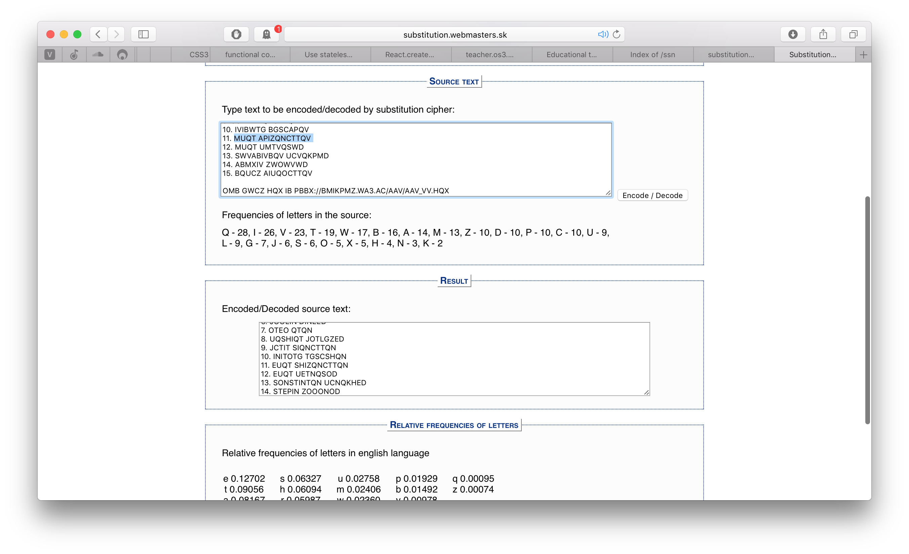

# Security of Systems and Networks: Lab 4

**Author**: Emil A. Sharifullin 
**Date**:   1 November, 2016  

Symmetrical Encryption

### DES

####  Use the DES simulator at http://lpb.canb.auug.org.au/adfa/src/DEScalc/index.html Step through the process of encrypting your name with the key 0x0101010101010101 and write the internal state of the device at the 8th round.

To convert my name to hex I used next python command

```python
In [1]: "".join(map(lambda x: "{:x}".format(ord(x)), "Emil"))
Out[1]: '456d696c'
```

After I have my name in hex I need to add zeroes to end to make key and plaintext lengths same. Now I can run program and encrypt my name with DEA.  

 

At eight step I have following state of device `Rnd8	f(R7=e339dcb4, SK8=00 00 00 00 00 00 00 00 ) = 423c1438`. It mens that right half of data contains e339dcb4 and step key is 0x0000000000000000

#### Inspect the key schedule phase for the given key and explain how the sub keys are generated for each of the 16 steps

Every phaze key is equal to 0x0000000000000000 because at the first step of keys generation we need to delete every 8'th bit and every single 1 is lost. After that on every round key are added one bit to make number of 1 in byte even. At this addition because in whole key bits is zeroes round key is equal zero.  At this step we have keys that is equal to  0x0000000000000000. After addition of bits we need to permutate bits in round key and in case that every certain bit in round key is equal to 0 permutation will also give  0x0000000000000000. After all steps round key is ready to XOR with data

#### Comment on the behavior of DES when using the given key.
So in case that algorithm deleted every 8'th bit the key was became weaker.

### AES

#### Identify the Shannon diffusion element(s).

For every stage key rot word shifts and after this subByte's depending on table. So for every round key byte with changed bit locates on new position and subByte operations return absolutely different value for byte with changed bit. The rot word also influences to other words in round key so the greater key operations we make the greater key changes.

#### Also identify the Shannon confusion element(s).

Every stage(except last one) contains four operations:

- SubBytes
- ShiftRows
- MixColumns
- AddRoundKey

In encryption round contains subBytes operation that changes byte value highly because single changed bit can cause absolutely different choise of cell in substitution box. After subBytes at encryption stage columns are shifted and mixed that changes location of byte with changed bit and make avalanche effect of data changing.

### Bonus: RC4
After visiting site http://teacher.os3.su/ssn/Instructions.txt I realized that this is the ciphertext and I assumed that cipher is an simple substitution. I understood this after I saw encrypted link. After this I started decryption with this link. I started with http:// in ciphertext it encoded with pbbx:// so here we have first three letters of substitution:
* p -> h
* b -> t
* x -> p

So good start. After this I saw very familiar template **wa3** that in my opinion means that this is os3 and we have another two substitutions

* w -> o
* a -> s

This is very important point because after this I can see another template: **ssv** is very similar to ssn and here we can assume that 
* v -> n

At this point I have three letters from my surname: s, h and n and I can identify that MUQT APIZQNCTTQV is my name because this


So I can assume that my nimber is 11 and I can follow the link http://teacher.os3.su/ssn/ssn_11.zip

Now I should to install python packages

```bash
➜  lab_4 git:(master) ✗ python3 -m venv venv 
➜  lab_4 git:(master) ✗ source venv/bin/activate 
(venv) ➜  lab_4 git:(master) ✗ python3 -m pip install pycrypto numpy
```
I opened all files with text redactor and two files seems to be different than other. I tried to solve this two files firstly